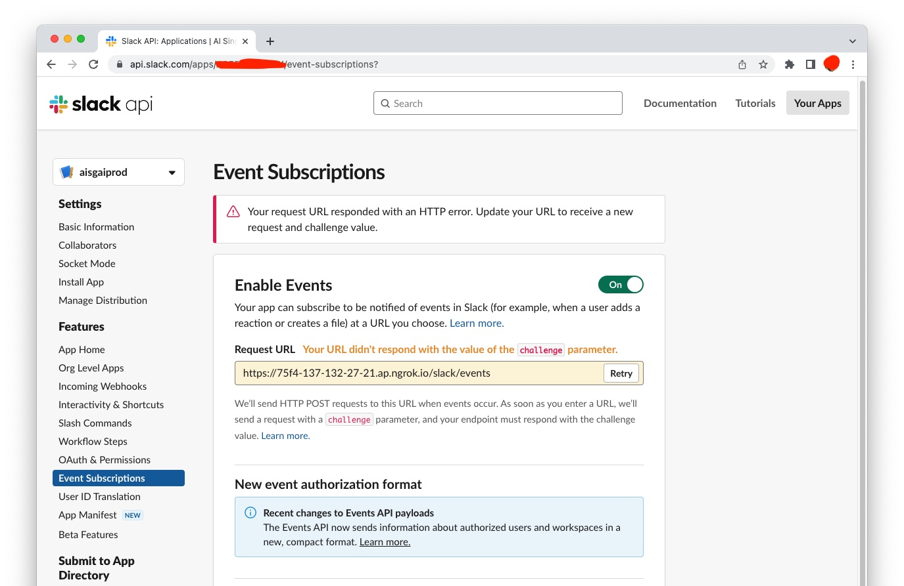
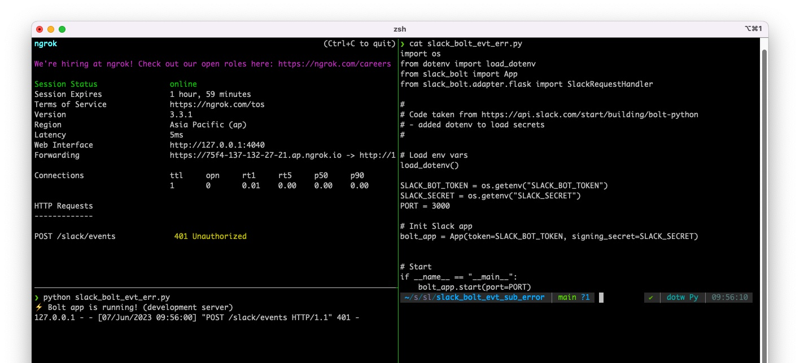

# slack_bolt_evt_sub_error
Demo Code to Show Slack Bolt Event Subscription Error (7 Jun 2023)

Followed the instructions from https://api.slack.com/start/building/bolt-python 
Encountered the following error when I got to section *Subscribing to Events*

Slack API Website Error:

Terminal Windows showing Code, `ngrok` and runtime output:

The `ngrok` window shows `401 Unauthorized` error. Either:
1.  The Slack API website is not sending the correct credentials. 
(the value for `SLACK_SECRET` in the code is copied from the API website)
2.  The Bolt `App` is not handling the `slack/events` call correctly.
